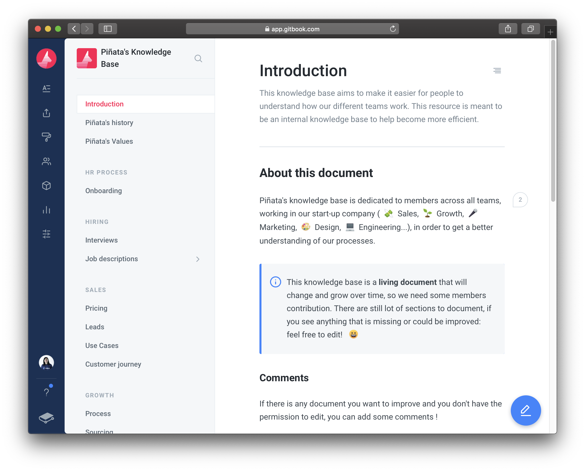

# Quick Start

## Introduction

Move around the tabs below to get started browsing at this GitBook space. We'll convert this one into usual ones to make it compatible with older browsers. 


Make sure your browser is up-to-date to use interactive features at this GitBook. Visit [updatemybrowser.org](https://updatemybrowser.org/) and if you need an update, do it.




Welcome to the Community Central Da Files! This is where we place everything here from fandoms to podcasts and everything in between.

To get started in exploring the pages, select an page from [Table of Contents](https://docs.gitbook.com/content-editing/pages-structure#types-of-entries) on the left.




If you want to contribute, click here to [get an invite for contributors from the team or for new admins](https://t.me/MPTeamPH). And, if you want to join us, [let us know](https://t.me/MPTeamApplications_Bot) and we'll add you soon to the team.

There's another way to contribute here: editing it on GitHub by contributing to our public repo on GitHub. See the [basic rules here](contribute/help/rules.md) before you proceed.



## FAQs

You have questions that we can answer in our FAQs page. Click the link button below to read them. We'll continuously update the FAQs as more questions we've been received in Telegram and on GitHub.



### Your question still unanswered?

Don't fret. The Pins' team built an Telegram chat for you about this project and other open-source projects we've been working on.

To access that, follow one of these options:

* On the header \(top-most corner of the screen\) for desktop users, click **Discuss on Telegram link** on any page within this space.
* For mobile users, tap the hamburger \(or three horizontal menu\) icon, then tap **Discuss on Telegram**.
* If you have an Telegram app, [tap/click this one](https://t.me/joinchat/Kg1fIBTLOiGA4FyaI6zT5g) \(or copy this to your browser's address bar and hit the road: `tg://join?invite=Kg1fIBTLOiGA4FyaI6zT5g`\).

